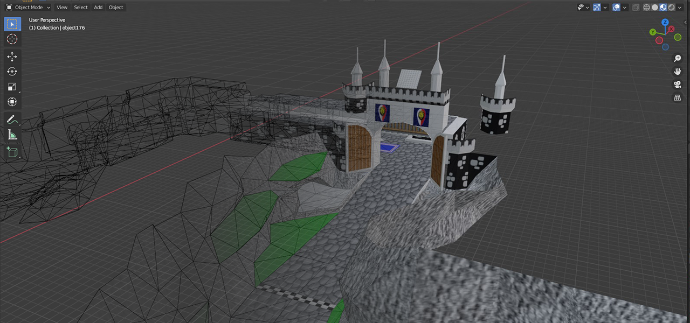

# Lego Racers Mod

Modding tools and experiments for [LEGO Racers (1999)](https://en.wikipedia.org/wiki/Lego_Racers_(video_game)).

This project is mostly aiming to have fun experimenting with the game and its files.
Many of the features it currently has were most probably already implemented somewhere else.

## Features

This project has two parts: The ProxyLibrary for runtime modifications and the modding tools.

### The ProxyLibrary

The ProxyLibrary is loaded when the game starts and modifies its code.
Currently only the 2001 release binary is supported.

Features currently include:
- **Loading of modding assets:** Additionally to the main asset file `LEGO.JAM` another JAM file `MOD.JAM` is also loaded.
All included files override the files of the vanilla JAM file.

- **Window mode fix:** The game can be launched in windowed mode on modern systems.
For this launch the game with the following parameters: `-window -novideo -horzres 640 -vertres 480`

- **Debug logging:** Logs debug information to the console.

So currently not much but with the potential to add more in the future.

### The Modding Tools

The modding tools provide the ability to dump and rebuild game assets.
Assets are contained within JAM files, the game's container file for assets (The vanilla game has only one: `LEGO.JAM`).

JAM files internally have a filesystem-like structure and can be dumped to a folder and rebuilt from a folder using the JamFileTool.
Each file inside a JAM file represents an asset with the extension specifying the asset type.

Each asset type has its own individual format.
Currently every asset type can be dumped and rebuilt in JAM files in its original binary form.
Some asset types that have custom code can also be dumped in a better readable text based format to be able to modify them.
The text file format of these assets tries to represent the binary structure as much as possible in the most cases.

You can convert these text based formats to more commonly used formats whenever implemented using the AssetConverter.
For example `.GDB` files, the game's model format, can be converted to `.OBJ` using AssetConverter to be able to import it into applications like Blender.



Currently the amount of support asset types is still a bit slim but support for further asset types can be added in the future to improve the amount of moddability.

## Getting started

### Prerequisites

This is the stuff you need to have installed to get started:

- Visual Studio 2022 (older versions might work as well)
- Git
- (Optional) Java (version 1.6 or higher; if you want to generate ANTLR4 parsers)

Dependencies are installed via git submodules.
Therefore the project must be cloned via git and not downloaded as a zip or similar.

Generating ANTLR4 parsers is not mandatory.
Pre-generated parsers are checked in the repository.
However any changes to `.g4` files can only be applied when this is setup.

### Building

#### 1. Generate project files

This project uses [premake](https://premake.github.io) to generate a Visual Studio solution.
Its definition is done via lua files.
For more information check out the [premake documentation](https://premake.github.io/docs/).

To properly work with premake you *should not* make modifications to the Visual studio solution manually (with the exception being changes saved per user).
Any time the premake configuration is changed *or* any files part of the solution are added/removed you should regenerate the solution with premake.

To generate the solution, simply run `generate.bat`.
This will first download all required thirdparty dependencies via git submodules (if any changed) and then generates the Visual Studio solution.
Now you can open the generated solution file with Visual Studio.
It is located in `build/LegoRacersMod.sln`.

#### 2. (Optional) Specify custom arguments for premake

The project supports different different arguments that can be specified to premake to change certain behaviour either in the complication process or inside the compiled binary.
These arguments are given via command line arguments to the `generate.bat` script.

To not have to specify these arguments manually every time you want to generate the solution you can create a script to do it for you.
Simply create a new file in the repository root: `usergenerate.bat` (It will be ignored by git).
It should have the following content (Replace `YOUR_ARGS_HERE` with the desired arguments):
```batch
@echo off

cd %~dp0

./generate.bat YOUR_ARGS_HERE
```

The following options are available:

##### `--generate-parsers`

Specify this option to generate parser code within the compilation process.
This will require you to have Java 1.6 or higher installed on your machine.
The `java` executable must also be located inside a directory specified in the `PATH` environment variable.

This option **must** be used if you plan on modifying any ANTLR4 `.g4` files.
Otherwise your changes will not be applied to the generated parser code.

##### `--copy-to`

Specifying this option will copy the compiled ProxyLibrary to your game folder automatically after compiling succeeded.
This saves you the work of manually copying the compiled files to your game directory.

It is important that you specify the **directory** it should copy to and not a file path.

Example (Assuming your game is located in `C:\Users\Username\Documents\LegoRacers`; Change this to match your own game location):
```batch
./generate.bat --copy-to="C:\Users\Username\Documents\LegoRacers"
```

#### 3. Compilation

Now you don't need to do anything more than compiling all included projects.

If you did not setup automatically copying the executable into your game folder you will need to do this manually to launch the game with the modication.
For this you need to take the compiled ProxyLibrary `build/bin/Release_x86/DINPUT.dll` (or `Debug_x86` if you compiled in Debug mode) and copy it into your game folder (in the same directory as your `LEGORacers.exe` of the game).
Note that this will not replace any existing file.
To remove the mod simply delete the `DINPUT.dll` inside your game directory again.


## Thanks

Thank you to the people and posters of Rock Raiders United who's previous research has helped understanding some aspects of the assets.